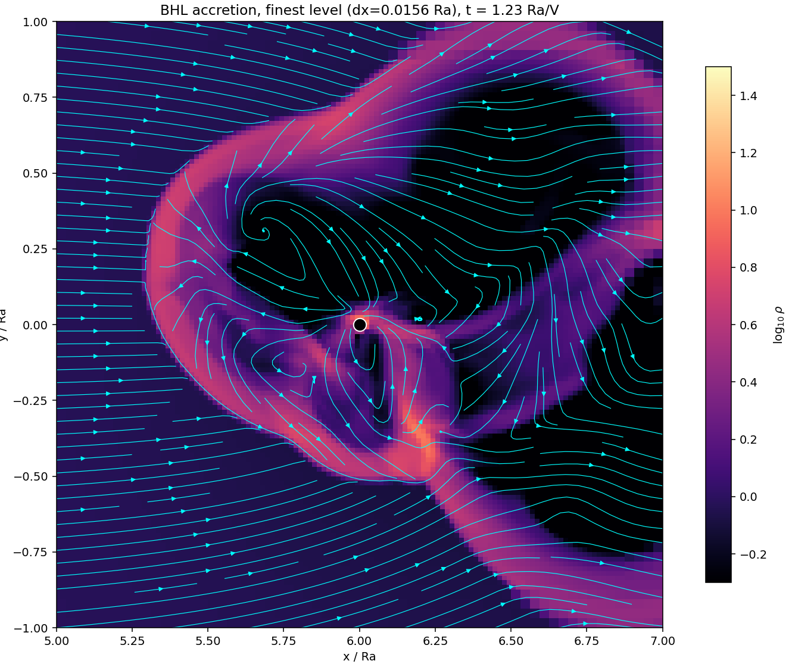

# Bondi–Hoyle–Lyttleton Accretion with Castro (AMR)

2D simulations of **Bondi–Hoyle–Lyttleton (BHL) accretion**, where a supersonic
wind flows past a gravitating point mass. They use the
[Castro](https://github.com/AMReX-Astro/Castro) adaptive-mesh-refinement
hydrodynamics code. The goal is to reproduce the **2D "flip-flop" instability**
of the accretion wake from
[Blondin & Pope (2009)](https://arxiv.org/abs/0905.2769), this time on a
**Cartesian AMR grid** instead of their polar grid.



*Log density near the accretor (black dot) at the finest AMR level
(dx = 0.0156 Ra), t = 1.23 Ra/V. The cyan lines are velocity streamlines. The
picture shows the bow shock, the gravitationally focused accretion flow and an
asymmetric rotating wake, which is the onset of the flip-flop instability.*

---

## Highlights

- A self-contained Castro problem setup. **No core Castro source is modified.**
  Everything uses Castro's existing problem hooks.
- A Mach-4 wind (γ = 4/3) with native point-mass gravity, evolved stably on
  **3 levels of AMR** with refinement based on distance from the accretor.
- Python (yt + matplotlib) scripts that extract the finest-level data and plot
  density maps with streamlines.

## Physics setup

| Parameter | Value |
|---|---|
| Units | ρ∞ = 1, V∞ = 1, Ra = 2GM/V∞² = 1 (so GM = 0.5) |
| Mach number | 4 (c∞ = 0.25) |
| Adiabatic index | γ = 4/3 |
| Domain | [−6, 18] × [−8, 8] Ra, accretor at (6, 0) |
| Base grid / AMR | 192 × 128 + 3 levels (finest dx = 0.0156 Ra) |
| Hydro | CTU, PPM reconstruction, CGF Riemann solver |
| Boundaries | wind inflow at x-low, outflow elsewhere |

## Repository contents

| File | Purpose |
|---|---|
| `problem_initialize.H` | derived quantities (Ra, sound speed, pressure, …) |
| `problem_initialize_state_data.H` | uniform-wind initial condition |
| `problem_bc_fill.H` | upstream wind inflow boundary |
| `problem_source.H` | softened gravity + absorbing sink (work in progress, off by default) |
| `problem_tagging.H` | nested, distance-based AMR refinement around the accretor |
| `_prob_params` | runtime problem parameters |
| `inputs` | Castro runtime configuration |
| `GNUmakefile`, `Make.package` | build files |
| `plot_bhl.py`, `plot_amr.py`, `plot_zoom.py` | post-processing and figures |
| `REPORT.md` | detailed technical report |

## Build & run

This directory is a Castro problem, so it has to sit inside a Castro checkout:

```bash
git clone --recursive https://github.com/AMReX-Astro/Castro.git
cp -r <this-repo> Castro/Exec/science/bhl_accretion
cd Castro/Exec/science/bhl_accretion

make COMP=gnu USE_MPI=TRUE -j8
mpirun -np 4 ./Castro2d.gnu.MPI.ex inputs
```

To reproduce the zoom figure (192×128 base grid, 3 AMR levels):

```bash
mpirun -np 4 ./Castro2d.gnu.MPI.ex inputs \
    amr.n_cell="192 128" amr.max_level=3 problem.refine_radius=3 \
    castro.cfl=0.3 castro.small_dens=1e-6
```

<details>
<summary>macOS (Apple Silicon) notes</summary>

`mpicxx` wraps Apple clang by default. Point it at Homebrew GCC instead, and run
the build twice the first time, because GNU Make 3.81 races the generated
`runtime_params.cpp`:

```bash
export OMPI_CC=gcc-15 OMPI_CXX=g++-15 OMPI_FC=gfortran
make COMP=gnu USE_MPI=TRUE -j8   # generates sources
make COMP=gnu USE_MPI=TRUE -j8   # links the executable
```
</details>

## Visualization

Requires Python with `yt`, `numpy` and `matplotlib`:

```bash
pip install yt numpy matplotlib
python plot_zoom.py      # -> bhl_zoom.png (reads plt00300)
python plot_amr.py       # -> bhl_amr.png  (full domain + AMR grid boxes)
python plot_bhl.py       # -> bhl_density.png (time series)
```

## Status & roadmap

- [x] Build, initial and boundary conditions, I/O (MPI, 2D)
- [x] Point-mass gravity + AMR: stable runs showing a bow shock and an
      asymmetric wake
- [ ] Absorbing sink: measure the accretion rate (target Ṁ ≈ 0.9 · 2RaρV)
- [ ] Longer runs: fit the flip-flop growth rate against Blondin & Pope
      model A (ω_r ≈ 0.070)
- [ ] Parameter study over Mach number, γ and accretor size

## References

- Blondin & Pope (2009), ApJ 700, 95: *Revisiting the Flip-Flop Instability of Hoyle–Lyttleton Accretion*
- Edgar (2004), New Astron. Rev. 48, 843: a review of BHL accretion
- Fryxell & Taam (1988): discovery of the 2D flip-flop instability
- Hoyle & Lyttleton (1939); Bondi & Hoyle (1944)
- [Castro](https://github.com/AMReX-Astro/Castro) / [AMReX](https://github.com/AMReX-Codes/amrex)
